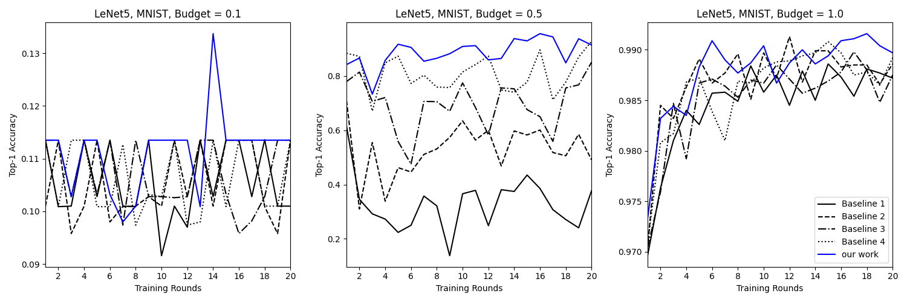

# NeuronDP


## Table of contents

- [1 Introduction](#1-introduction)
- [2 How to get started](#2-how-to-get-started)
  * [2.1 Setup](#21-setup)
  * [2.2 Usage](#22-usage)
- [3 Supported models and datasets](#3-supported-models-and-datasets)
- [4 Experiments](#4-Experiments)
  * [4.1 Evaluation on homogeneous settings](#41-Evaluation-on-homogeneous-settings)
  * [4.2 Evaluation on heterogeneous settings](#42-Evaluation-on-heterogeneous-settings)

## 1. Introduction

NeuronDP is a differential privacy federated learning framework that adds noise at the neuron level. It currently supports six different networks:  MLP, LeNet5 (60k parameters), AlexNet (61.5 million param-eters), ResNet18 (11.7 million parameters), VGG11 (133 million parameters), DenseNet121 (8 million parameters). Besides, NeuronDP introduces a model distillation-based approach to enable it in FL across the heterogeneous models.

## 2. How to get started

### 2.1 Setup

**Requirements**

- Linux or Windows
- Python 3.9+
- PyTorch 1.9+
- CUDA 10.2+

**Preparing the virtual environment**

1. Create a conda environment and activate it.

   ```
   conda create -n NeuronDP python=3.7
   conda active NeuronDP
   ```

2. Install PyTorch 1.9+ in the [offical website](https://pytorch.org/). A NVIDIA graphics card and PyTorch with CUDA are recommended.


3. Clone this repository and install the dependencies.

   ```
   git clone https://github.com/LINC-BIT/NeuronDP.git
   pip install -r requirements.txt
   ```

### 2.2 Usage

- **Example of NeuronDP on homogeneous settings**

  ```bash
  ./run_homo.sh --alg [alg] --dataset [dataset] --model [mdoel] --num_users [num_users]  --num_rounds [num_rounds] --frac [frac] --num_local_epochs [num_local_epochs] --lr [lr] --local_bs [local_bs] --epsilon [epsilon] --delta [delta] --gpu [gpu]
  ```

  The `run_homo.sh` script starts processes in the background. It first starts the server, then starts `[num_users]` clients for federated learning. The arguments are listed below:

  - `alg`: the algorithm, e.g. `NeuronDP`, `DPFL`, `LDPFL`, `PEDPFL`
  - `dataset` : the dataset, e.g. `MNIST`, `CIFAR10`
  - `model`: the model, e.g. `MLP`, `ResNet18`
  - `num_users`: the number of clients
  - `num_rounds`: the number of rounds
  - `frac`: the percentage of clients participating in training in each epoch
  - `num_local_epochs`: the number of epochs in clients
  - `lr`: the learning rate
  - `local_bs`: the batch size in each client
  - `epsilon`: DP argument $\epsilon$
  - `delta`: DP argument $\delta$
  - `gpu`: GPU id

- **Example of NeuronDP on homogeneous settings**

  ```bash
  ./run_heter.sh --neurondp [neurondp] --private_dataset [private_dataset] --public_dataset [public_dataset] --model_a [mdoel_a] --model_b [model_b] --num_users_a [num_users_a] --num_users_b [num_users_b] --num_rounds [num_rounds] --num_local_epochs [num_local_epochs] --lr [lr] --local_bs [local_bs] --epsilon [epsilon] --delta [delta] --gpu [gpu]
  ```

  Arguments:

  - `neurondp`: whether use NeuronDP or not,  e.g. `yes`/`no`
  - `private_dataset`: the private_dataset for FedMD, default as `CIFAR100`
  - `public_dataset`: the private_dataset for FedMD, default as `CIFAR10`
  - `model_a`: one of the models to use, default as `LeNet5`
  - `model_b`: one of the models to use, default as `ResNet18`
  - `num_users_a`: number of users that use `model_a`
  - `num_users_b`: number of users that use `model_b`

## 3. Supported models and datasets

|      |                          Model Name                          |                           Dataset                            |
| :--: | :----------------------------------------------------------: | :----------------------------------------------------------: |
|  ☑   |                             MLP                              | [MNIST](http:// yann.lecun.com/exdb/mnist/), [CIFAR10](https://www.cs.toronto.edu/~kriz/cifar-10-python.tar.gz) |
|  ☑   |     [LeNet5](https://hal.science/hal-03926082/document)      | [MNIST](http:// yann.lecun.com/exdb/mnist/), [CIFAR10](https://www.cs.toronto.edu/~kriz/cifar-10-python.tar.gz) |
|  ☑   | [AlexNet](https://proceedings.neurips.cc/paper/2012/file/c399862d3b9d6b76c8436e924a68c45b-Paper.pdf) | [CIFAR10](https://www.cs.toronto.edu/~kriz/cifar-10-python.tar.gz) |
|  ☑   | [ResNet18](https://openaccess.thecvf.com/content_cvpr_2016/papers/He_Deep_Residual_Learning_CVPR_2016_paper.pdf) | [CIFAR10](https://www.cs.toronto.edu/~kriz/cifar-10-python.tar.gz) |
|  ☑   |    [VGG11](https://arxiv.org/pdf/1409.1556.pdf%E3%80%82)     | [CIFAR10](https://www.cs.toronto.edu/~kriz/cifar-10-python.tar.gz) |
|  ☑   | [DenseNet121](http://openaccess.thecvf.com/content_cvpr_2017/papers/Huang_Densely_Connected_Convolutional_CVPR_2017_paper.pdf) | [CIFAR10](https://www.cs.toronto.edu/~kriz/cifar-10-python.tar.gz) |


## 4. Experiments

### 4.1 Evaluation on homogeneous settings

In the Evaluation on homogeneous settings, it is necessary to clarify the model and dataset arguments.

- MLP on MNIST

  **demo:**

  ```bash
  ./run_homo.sh --alg NeuronDP --dataset MNIST --model MLP --num_users 10 --num_rounds 20 --frac 1 --num_local_epochs 3 --lr 0.001 --local_bs 64 --epsilon 0.1 --delta 0.001 --gpu 0
  ```

  **result:**

  

- LeNet5 on MNIST

  **demo:**

    ```bash
    ./run_homo.sh --alg NeuronDP --dataset MNIST --model LeNet5 --num_users 10 --num_rounds 20 --frac 1 --num_local_epochs 3 --lr 0.001 --local_bs 64 --epsilon 0.1 --delta 0.001 --gpu 0
    ```

  **result:**



- MLP on CIFAR-10

  **demo:**

  ```bash
  ./run_homo.sh --alg NeuronDP --dataset CIFAR10 --model MLP --num_users 10 --num_rounds 20 --frac 1 --num_local_epochs 3 --lr 0.001 --local_bs 64 --epsilon 0.1 --delta 0.001 --gpu 0
  ```

  **result:**

  

- LeNet5 on CIFAR-10

  **demo:**

  ```bash
  ./run_homo.sh --alg NeuronDP --dataset CIFAR10 --model LeNet5 --num_users 10 --num_rounds 20 --frac 1 --num_local_epochs 3 --lr 0.001 --local_bs 64 --epsilon 0.1 --delta 0.001 --gpu 0
  ```

  **result:**


- AlexNet on CIFAR-10

  **demo:**

  ```bash
  ./run_homo.sh --alg NeuronDP --dataset CIFAR10 --model AlexNet --num_users 10 --num_rounds 20 --frac 1 --num_local_epochs 3 --lr 0.001 --local_bs 64 --epsilon 0.1 --delta 0.001 --gpu 0
  ```

  **result:**


- DenseNet121 on CIFAR-10

  **demo:**

  ```bash
  ./run_homo.sh --alg NeuronDP --dataset CIFAR10 --model DenseNet121 --num_users 10 --num_rounds 20 --frac 1 --num_local_epochs 3 --lr 0.001 --local_bs 64 --epsilon 0.1 --delta 0.001 --gpu 0
  ```

  **result:**


- ResNet18 on CIFAR-10

  **demo:**

  ```bash
  ./run_homo.sh --alg NeuronDP --dataset CIFAR10 --model ResNet18 --num_users 10 --num_rounds 20 --frac 1 --num_local_epochs 3 --lr 0.001 --local_bs 64 --epsilon 0.1 --delta 0.001 --gpu 0
  ```

  **result:**


- VGG11 on CIFAR-10

  **demo:**

  ```bash
  ./run_homo.sh --alg NeuronDP --dataset CIFAR10 --model VGG11 --num_users 10 --num_rounds 20 --frac 1 --num_local_epochs 3 --lr 0.001 --local_bs 64 --epsilon 0.1 --delta 0.001 --gpu 0
  ```

  **result:**


### 4.2 Evaluation on heterogeneous settings

In the Evaluation on heterogeneous settings, we use CIFAR-10 as the public dataset and a subset of the CIFAR-100 as the private dataset, LeNet5 and ResNet18 as two heterogeneous models.

- LeNet5 and ResNet18 on CIFAR-10

  **demo:**

  ```bash
  ./run_heter.sh --neurondp yes --num_users_a 5 --num_users_b 5 --num_rounds 20 --num_local_epochs 3 --lr 0.001 --local_bs 64 --epsilon 0.001 --delta 1.0 --gpu 0
  ```

  **result:**


